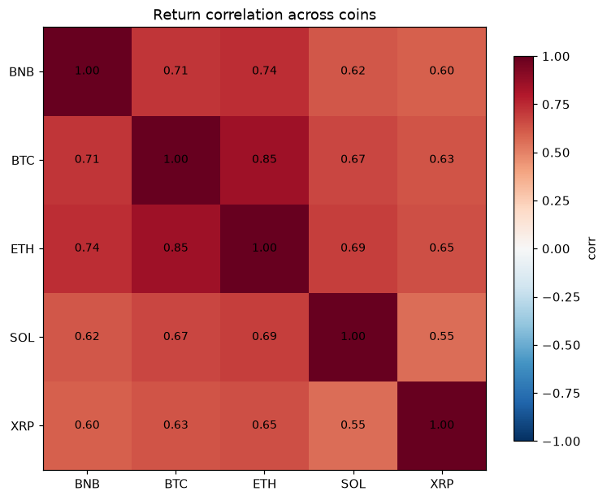

# 7-Day Crypto Volatility Forecasting

Predicts the **distribution** of where a coin's price lands over the next 7 days,
not a single number. Output looks like:

```
asset      last  vol_pred_%       q10       q50       q90  band_%
BTC    65098.97      1.83     60510.73  64858.48  69070.91   13.15
```

Read as: median 64,858, and an 80% chance BTC finishes between 60,511 and 69,071.

Trained on 5 assets (BTC, ETH, BNB, SOL, XRP), ~15k daily bars, 2017-2026. Every
number below is measured by walk-forward backtest across ~1,400+ out-of-sample
origins. The published scoreboard is in `RESULTS.md`; the original machine-generated
experiment log is retained as `results_legacy.csv`.

---

## Why intervals, not a price

Three questions, each tested against a dumb baseline before any model was trusted:

| question | answer | where |
|---|---|---|
| Predict direction? | **No robust signal.** Results varied by model and test window. | `RESULTS.md` |
| Predict the price level? | **No.** LightGBM, XGBoost, ARIMA, SARIMA, Linear Regression all lost to `flat`. | `experiments/baselines.py`, `experiments/classical_price.py` |
| Predict volatility? | **Yes.** Every model beats the 21-day rolling average at all 7 horizons. | `tree.run`, `neural.run` |

So the models predict volatility, and an empirically calibrated quantile table
turns that into a price interval. Coverage lands near the 80% target.

---

## Results (deployable models, ~1,400 origins)

| model | family | pinball | coverage (target 80) |
|---|---|---|---|
| lstm | neural | 162.97 | 80.0 |
| dlinear | neural | 163.22 | 79.7 |
| xgb | tree | 166.98 | 79.0 |
| lgbm | tree | 167.92 | 78.7 |

Neural (sequence input) edges the trees (engineered features) by ~3% - small, and
DLinear ≈ LSTM, so the gain is the sequence representation, not depth. All four are
near-interchangeable; the ceiling is the data, not the model.

The linear family (Ridge, HAR-RV, GARCH) and classical price models (ARIMA, SARIMA)
are backtested for comparison but not deployed - they refit per series on demand.

**Full scoreboard incl. the 15-min transformer experiments: [RESULTS.md](RESULTS.md).**



---

## Layout

```
crypto/        shared: data fetch, features, backtest, calibration, plots, train
tree/          LightGBM, XGBoost      (adapter = raw features)
linear/        Ridge, HAR-RV, GARCH   (adapter = scale + clip)
neural/        DLinear, LSTM          (adapter = 30-day sequence windows)
experiments/   baselines, model_zoo, classical_price
data/          raw parquet (gitignored, rebuildable)
models/        small neural artifacts committed; tree artifacts rebuildable
results_legacy.csv  archived machine-generated experiment log
RESULTS.md     curated scoreboard with pipeline-specific caveats
```

Feature CONTENT is shared in `crypto/features.py`; each family folder holds only
its input adapter. Same features, three formats - no duplicated logic. Adding a
model is one file named after it (e.g. `tree/xgb.py`).

---

## Usage

```bash
python -m venv .venv
.\.venv\Scripts\python.exe -m pip install -r requirements.txt

.\.venv\Scripts\python.exe fetch.py        # pull OHLCV + funding + open interest

# backtest a whole family (scores -> results.csv)
.\.venv\Scripts\python.exe -m tree.run
.\.venv\Scripts\python.exe -m linear.run
.\.venv\Scripts\python.exe -m neural.run

# train + save + plot one model (artifact -> models/, svg -> plots/)
.\.venv\Scripts\python.exe -m tree.lgbm
.\.venv\Scripts\python.exe -m tree.xgb
.\.venv\Scripts\python.exe -m neural.dlinear
.\.venv\Scripts\python.exe -m neural.lstm

# forecast the next 7 days from any saved model
.\.venv\Scripts\python.exe predict.py --model lstm
.\.venv\Scripts\python.exe predict.py --model xgb --asset BTC --horizon 4
```

Change the coin universe in `crypto/data.py` (`ASSETS`), then re-fetch and retrain.

---

## The model

```
sigma       = model(features)                    -> predicted daily volatility
price[q, h] = last * exp( z[h][q] * sigma * sqrt(h) )
```

`z` is a 7x3 table of **empirical** quantiles of standardised h-day returns, fit on
a held-out slice of training data. It replaces the normal distribution and shows
what the data actually does:

- `|z10| > |z90|` at every horizon - the left tail is fatter. Crashes outrun rallies.
- `|z|` shrinks from ~2.7 (h=1) to ~1.4 (h=7) - `sqrt(h)` alone overstates the spread.

---

## Rules this repo enforces

1. **Baseline first.** No model ships without beating flat / drift / seasonal.
2. **Features are causal.** The daily pipeline's `check_causal()` corrupts the last
   200 bars, rebuilds features, and asserts that nothing earlier moved.
3. **Targets are never features.** The original code fed `target_return_1h` (next-day
   data) into the model, invalidating every metric it produced.
4. **Calibration is a model too.** It gets its own holdout. Fitting the quantile table
   in-sample dropped coverage from 80% to 64%.
5. **Walk-forward, never a single split.** One 80/20 cut tests one market regime.

---

## Known limits

- `data/open_interest.parquet` accumulates daily and **cannot be backfilled** -
  Binance serves ~30 days. Do not delete it; back it up outside the repo.
- Coverage runs ~1-2pp light on some models (78-79 vs 80). Fixable with a widening
  factor; not applied yet.
- The 15-minute N-HiTS/TFT experiments use only 16 test origins, so their exact
  coverage and directional metrics are not strong enough for resume claims.
- Daily plots are lightweight SVG; high-frequency diagnostics use matplotlib PNGs.
