# Cryptocurrency Volatility Forecasting

An end-to-end data science project for forecasting cryptocurrency uncertainty.
The completed pipeline estimates daily realized volatility for five assets and
converts it into calibrated 1-to-7-day price intervals. It does **not** claim to
predict a profitable buy/sell strategy.

The central result is deliberately modest: on the recorded historical
selection/evaluation sample, an LSTM produced the lowest aggregate pinball loss
and approximately 80% interval coverage. Direct price-level models did not
consistently beat a flat-price baseline across the reported metrics, and
directional accuracy was not stable enough to claim a trading edge.

## Project at a glance

| Component | Implementation |
|---|---|
| Data source | Binance spot OHLCV and perpetual-futures funding, downloaded with CCXT |
| Assets | BTC, ETH, BNB, SOL and XRP, quoted in USDT |
| Completed task | Forecast daily realized volatility and calibrated price intervals for horizons 1-7 days |
| Historical sample | 14,884 daily rows from 2017-08-17 through 2026-07-23 |
| Evaluation | Expanding-window, purged walk-forward evaluation over 1,445 out-of-sample origins |
| Final tree inputs | 24 causal return, volatility, range, volume, market and funding features |
| Models compared | Naive and statistical baselines, linear models, LightGBM, XGBoost, DLinear and LSTM |
| Best recorded daily model | LSTM: 162.49 pinball loss and 80.02% coverage |
| Additional research | Legacy 15-minute/2-hour neural forecasts; next-day TFT experiment is pending |

## 1. Problem definition

The project began with a broad question: **can historical cryptocurrency market
data predict future prices?** Three formulations were tested.

1. **Price level:** predict the future closing price directly.
2. **Direction:** predict whether the future return is positive or negative.
3. **Uncertainty:** predict future realized volatility, then construct a range
   in which the future price is expected to fall.

The first two formulations did not produce robust evidence. ARIMA, SARIMA and
linear regression did not beat a naive unchanged-price forecast on the reported
MAPE and MASE comparisons. ARIMA was narrowly better on raw MAE in one recorded
comparison, which is not a consistent improvement across metrics. Directional
measurements also varied materially across architectures and test windows.

The final daily task therefore focuses on probabilistic forecasting:

```text
historical market data -> predicted volatility -> calibrated q10/q50/q90 price interval
```

This formulation is useful because it measures uncertainty instead of relying on
a fragile point forecast. The q10-to-q90 interval targets 80% empirical coverage.

## 2. Dataset selection

### Why this dataset

BTC, ETH, BNB, SOL and XRP were selected as a fixed panel of established,
high-liquidity assets with substantial trading histories. A common USDT quote
currency makes prices and market features easier to align, while the panel still
contains different launch dates and market behavior. Binance provides OHLCV and
funding data through consistent APIs, allowing the same collection and validation
logic to be applied across all assets.

Daily bars match the completed 1-to-7-day volatility task. A separate 15-minute
dataset was collected for high-frequency sequence experiments and the planned
next-day TFT forecast.

### Data used

| Dataset | Rows | Coverage | Role |
|---|---:|---|---|
| Daily OHLCV | 14,884 | 2017-08-17 to 2026-07-23 | Completed 7-day volatility pipeline |
| 15-minute OHLCV | 977,630 | 2021-01-01 to 2026-07-31 | Legacy 2-hour experiments and pending next-day TFT |
| Daily funding | 11,827 | 2019-09-10 to 2026-07-23 | Crowding and derivatives-market features |
| Open interest | 145 selected-asset rows; 899 in the accumulated file | 2026-06-25 to 2026-07-23 | Collected but excluded from final features because the retained history is too short |

Daily observations per asset are unequal because the assets began trading at
different dates: BTC and ETH have 3,263 rows each, BNB 3,182, XRP 3,003 and SOL
2,173. Models therefore use available panel history rather than forcing every
asset to begin on SOL's later start date.

### Dataset limitations

- The five assets form a fixed research universe, not a reconstructed historical
  investable universe; survivorship and selection bias remain possible.
- All market data comes from one exchange.
- Funding begins later than spot prices.
- Binance exposes only limited historical open-interest data through the used
  endpoint. The accumulated file also retains 26 assets outside the selected
  five-asset panel, so open interest is not treated as a mature modeling feature.

## 3. Data collection, validation and cleaning

The collection code pages forward through Binance data and raises on repeated
request failures instead of silently accepting a truncated file. Before a dataset
is written to Parquet, the pipeline applies the following checks:

1. Convert timestamps to timezone-aware UTC.
2. Remove the still-forming final candle, whose partial close would leak
   information unavailable at a real forecast origin.
3. Remove duplicate `(asset, date)` rows.
4. Sort each asset chronologically.
5. Reject non-positive OHLC prices.
6. Reject candles where `high < low`.
7. Require a minimum history per asset: one year for daily data and six months
   for intraday data.
8. Aggregate the normally three daily funding settlements into `funding_sum`.

Rolling features naturally create missing values at the start of each asset's
history. Future-return and future-volatility labels also become unavailable at
the end of a series. These rows are excluded only when their required features or
labels are unavailable; missing targets are never imputed.

The pending next-day TFT pipeline applies additional intraday gap handling. It
builds a complete 15-minute grid, fills a missing candle's OHLC with the previous
close, sets its volume to zero and records a `missing_bar` indicator. Synthetic
bars may provide model context, but an evaluation origin is eligible only when
its complete future 96-bar target path contains observed candles.

## 4. Feature engineering

All production features are calculated from the current or preceding rows. Future
returns and realized volatility are labels only and are excluded from the model
input list.

### Final daily tree features

| Feature group | Features | Why included |
|---|---|---|
| Recent returns | `ret_lag1`, `ret_lag2`, `ret_lag3`, `ret_lag5`, `ret_lag8`, `ret_lag13` | Capture short-term shocks, reversal and persistence at several lags |
| Rolling momentum | `ret_5d`, `ret_10d`, `ret_21d`, `ret_63d` | Represent price movement across weekly, monthly and quarterly scales |
| Rolling volatility | `vol_5d`, `vol_10d`, `vol_21d`, `vol_63d` | Volatility clusters, so recent dispersion is a direct predictor of future dispersion |
| Intraday range | `range`, `range_5d` | High-low ranges contain information about realized variability beyond close-to-close returns |
| Trading activity | `vol_ratio` | Measures current volume relative to its recent 21-day level |
| Trend position | `px_vs_ma63` | Measures how far price is from its medium-term moving average |
| Market context | `btc_ret`, `btc_ret_5d` | Represents the shared market factor affecting altcoins |
| Derivatives positioning | `funding_sum`, `fund_7d`, `fund_21d`, `fund_z` | Represents leverage, crowding and abnormal funding conditions |

Three candidate features—`vol_regime`, `drawdown_63d` and `volume_z21`—were
tested through feature ablation. The predeclared selection rule required an
improvement in both overall and worst-fold normalized pinball loss. The candidate
set did not pass that rule, so these columns remain optional and are excluded from
the final 24-feature tree configuration.

### Daily neural inputs

The daily LSTM and DLinear models consume 30-day sequences with four channels:

| Channel | Meaning |
|---|---|
| `r` | Log return |
| `ar` | Absolute log return |
| `rng` | `(high - low) / close` |
| `dv` | Log-volume change |

These compact channels preserve temporal information without sending all 24
tabular features into the sequence models. Neural inputs are standardized using
fit-window statistics only.

### Targets and leakage prevention

For horizon `h`, the daily label is realized volatility over returns from
`t+1` through `t+h`. A separate label records the future price return used to
score the calibrated interval. Every label has an endpoint timestamp, allowing
the backtest to remove training rows whose outcome would cross a fold boundary.

The executable `check_causal()` test corrupts all raw prices after a cutoff,
rebuilds the feature table and asserts that the price/volume-derived features
before the cutoff are unchanged. Funding features are backward-looking by
construction but are not covered by this corruption test. The test protects
against the earlier project error in which a future target was accidentally
included as an input feature.

## 5. Modeling approach

Every model in the completed six-model daily interval evidence bundle predicts
the same quantity: **log realized volatility**. This makes comparisons within
that bundle meaningful because all predicted volatilities pass through the same
calibration and scoring code. The separate price-level experiments below use
their own price-forecast evaluation.

| Model | Why it was evaluated | Recorded role |
|---|---|---|
| Flat, drift and seasonal | Establish the minimum bar for direct price forecasting | Naive price baselines |
| 21-day rolling volatility | Strong causal benchmark based on volatility persistence | Primary volatility baseline |
| ARIMA and SARIMA | Test autoregressive and weekly-seasonal price structure | Did not beat flat on MAPE or MASE |
| Linear regression | Test whether a local linear price trend is sufficient | Did not beat flat on MAPE or MASE |
| Ridge | Linear control for the engineered volatility features | Diagnostic model |
| HAR-RV | Standard heterogeneous autoregressive volatility benchmark | Diagnostic model |
| GARCH(1,1) | Classical conditional-variance model | Diagnostic model |
| LightGBM | Efficient nonlinear interactions in tabular features | Final tree candidate |
| XGBoost | Independent boosted-tree implementation with matched capacity | Final tree candidate |
| Tree blend | Calibration-only convex combination of XGBoost and LightGBM | Final ensemble candidate |
| DLinear | Simple decomposition-based neural control | Final neural candidate |
| LSTM | Sequence model for volatility persistence and nonlinear temporal interactions | Final neural candidate |

LightGBM and XGBoost each use 300 estimators, a learning rate of 0.05 and
regularized row/column subsampling. DLinear separates a 30-day sequence into
moving-average trend and residual components before linear prediction. The LSTM
uses one 32-unit recurrent layer, 0.1 dropout and a seven-output horizon head.

The model output is converted into price intervals as follows:

```text
sigma_hat       = exp(model(features))
standardized_r  = future_log_return / (sigma_hat * sqrt(h))
q[h]            = empirical q10/q50/q90 of standardized_r on calibration data
price[q, h]     = last_price * exp(q[h] * sigma_hat * sqrt(h))
```

Empirical calibration is used instead of assuming normally distributed crypto
returns. The calibration table is estimated only on the chronological tail of
the training window and is then frozen for the fold's test observations.

## 6. Experimental design

Random train/test splits are inappropriate for time series because they mix past
and future market regimes. The daily experiment therefore uses expanding-window
walk-forward evaluation:

- Six calendar folds beginning in 2021 through 2026.
- Training dates are strictly earlier than each fold's test start.
- Rows are purged when any 1-to-7-day label endpoint reaches past the fit cutoff.
- The last 20% of each training window is reserved for interval calibration.
- Forecast origins occur every seven days.
- The final sample contains 1,445 unique `(asset, origin)` pairs: 289 per asset.
- Each model produces horizons 1 through 7 and q10/q50/q90 forecasts.

The resulting 10,115 forecast rows per model are out of sample relative to model
fit and calibration. However, these folds were also inspected during feature and
ensemble selection. They are therefore an exploratory selection/evaluation
sample, not a final untouched post-selection test. A locked comparison requires
future observations after the 2026-07-23 cutoff.

### Metrics

| Metric | Interpretation |
|---|---|
| Pinball loss | Quantile-aware forecast loss; lower is better |
| Pinball % | Pinball loss normalized by origin price for cross-asset comparison |
| Coverage | Percentage of actual prices inside q10-q90; target is 80% |
| Interval width | Average q10-q90 width as a percentage of the origin price; narrower is better only when coverage is maintained |
| Median-forecast MAPE | Percentage error of q50; useful but naturally small at short horizons |
| Directional accuracy | Sign agreement between predicted and actual returns; diagnostic, not evidence of profitability |
| Return R-squared | Explained variation in returns; preferable to price-level R-squared for non-stationary prices |

Pinball loss is the primary model-selection metric because the project predicts a
distribution, not just a median. Coverage and width jointly evaluate calibration:
a narrow interval that misses often is not useful, while a very wide interval can
achieve coverage without precision.

## 7. Completed daily results

Historical out-of-sample measurements use data through **2026-07-23** and
forecast origins through **2026-07-14**.

| Model | Family | Pinball | Pinball % | Coverage % | Width % | Median MAPE % |
|---|---|---:|---:|---:|---:|---:|
| **LSTM** | Neural | **162.49** | **1.944** | **80.02** | 18.27 | **5.71** |
| DLinear | Neural | 162.70 | 1.958 | 79.67 | 18.50 | 5.71 |
| Tree blend | Ensemble | 167.35 | 1.971 | 78.86 | 18.70 | 5.74 |
| XGBoost | Tree | 167.43 | 1.972 | 78.84 | 18.76 | 5.75 |
| 21-day volatility | Baseline | 167.69 | 2.024 | 79.43 | 20.56 | 5.79 |
| LightGBM | Tree | 167.83 | 1.975 | 78.90 | 18.87 | 5.74 |

### Interpretation

- LSTM recorded the lowest aggregate pinball loss and coverage closest to the
  80% target.
- LSTM's aggregate pinball loss was approximately 3.0% below XGBoost on this
  historical sample.
- DLinear finished extremely close to LSTM, showing that added recurrent
  complexity produced only a small measured advantage.
- The tree blend improved only narrowly over its individual tree models.
- LightGBM did not beat the 21-day-volatility baseline on aggregate pinball loss.
- Individual-horizon comparisons against the rolling-volatility baseline are
  mixed; the aggregate result should not be read as superiority at every horizon.
- Increasing LSTM capacity, lookback and training steps in a separate experiment
  did not improve its recorded accuracy, suggesting diminishing returns for that
  configuration.

These comparisons do not include confidence intervals for the differences and do
not prove future superiority. Exact unrounded results are stored in
[`metrics_overall.csv`](docs/evaluation/daily-20260723-finalfix-legacy-20260826-a2/metrics_overall.csv),
with horizon, asset, fold and regime breakdowns in the same evidence directory.

## 8. Result plots

The following figures are generated from the persisted walk-forward predictions,
not from in-sample fitted values.

### Overall model comparison

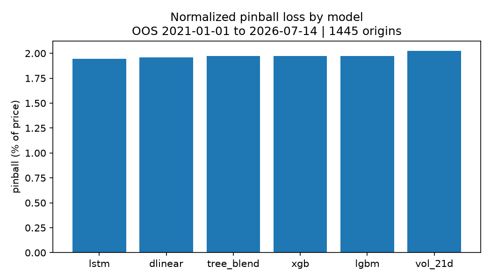

### Forecast intervals

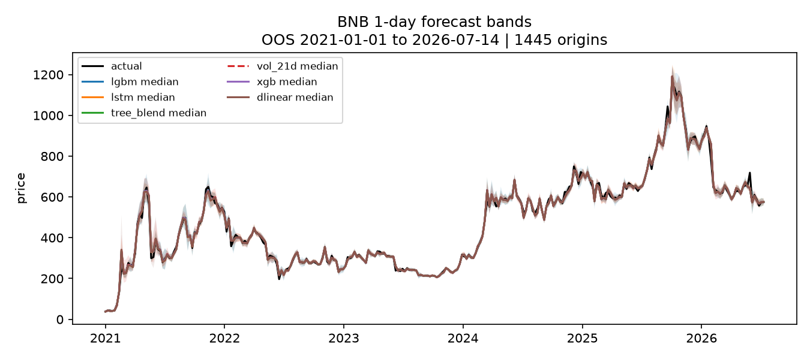

### Calibration by horizon

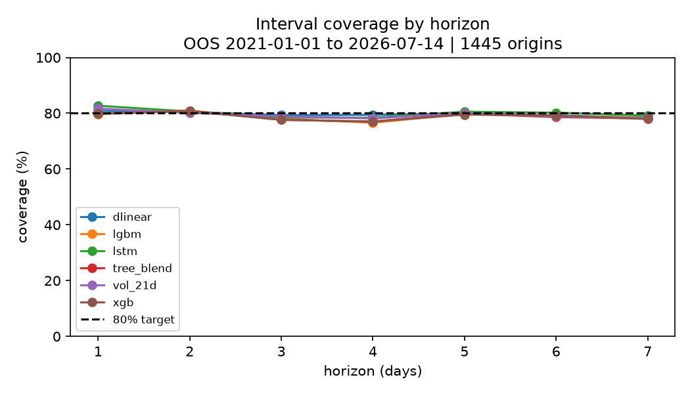

### Performance by asset

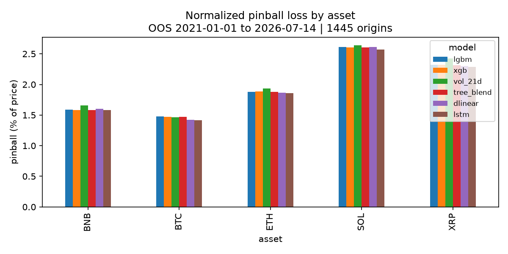

### Performance by market regime

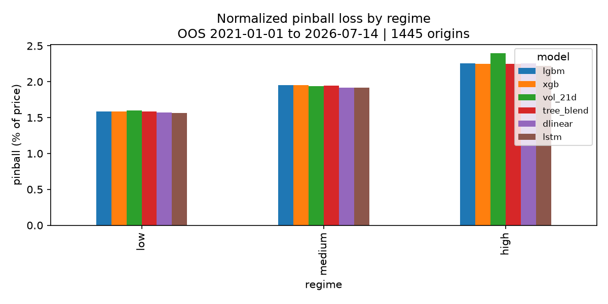

### Predicted versus realized volatility

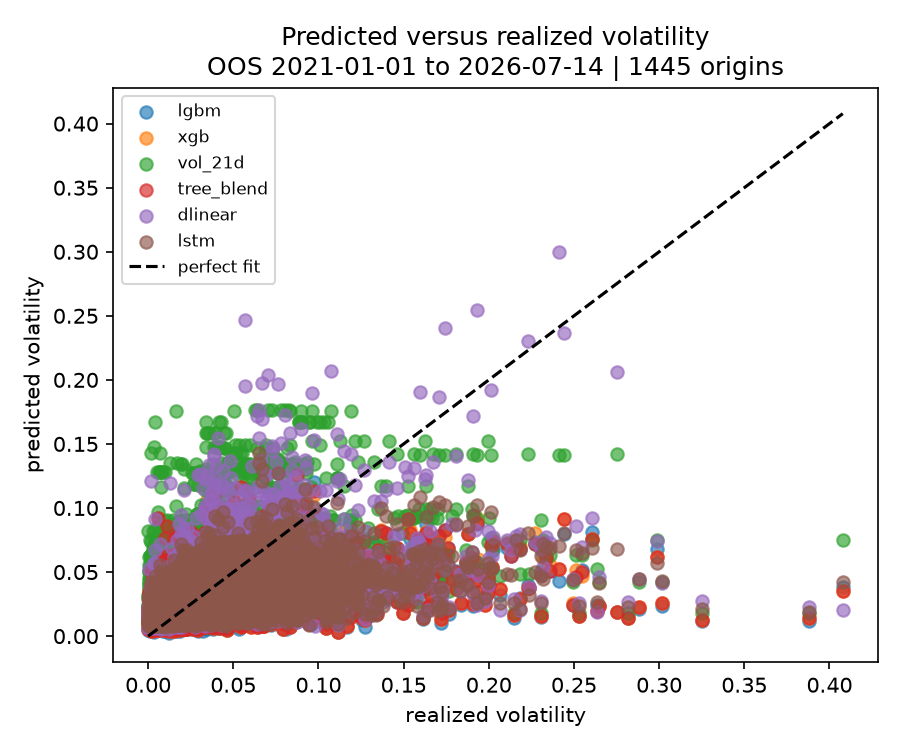

### Exploratory data analysis


## 9. Legacy high-frequency experiments

A separate legacy pipeline trained LSTM, GRU, N-HiTS and TFT models on roughly
one million 15-minute observations. The current LSTM, GRU and N-HiTS code uses a
192-bar lookback, an 8-bar/2-hour horizon and historical inputs `lret`, `aret`,
`rng` and `lvol`. The TFT row below is historical-only: the current TFT command
now routes to the separate 672-bar/96-bar next-day experiment.

The table below is retained as historical experiment evidence. It comes from an
older 1,000-step, 96-bar-lookback configuration with only **16 test origins** and
must not be combined with the daily metrics or the pending next-day TFT design.

| Model | Median MAPE % | Return R-squared | Direction accuracy % | Raw coverage % |
|---|---:|---:|---:|---:|
| N-HiTS | **0.27** | **+0.03** | **66.2** | 75.8 |
| TFT | 0.30 | -0.10 | 48.8 | 65.0 |
| GRU | 0.34 | -0.28 | 58.8 | 80.8 |
| LSTM | 0.35 | -0.31 | 63.8 | **81.3** |

N-HiTS recorded the strongest legacy point metrics, but 16 test origins are too
few for a resume-level claim. The low MAPE is also partly explained by the short
two-hour horizon, where a last-price forecast is already difficult to beat.
Directional accuracy ranged from 48.8% to 66.2% and changed sharply under model
configuration changes, so it does not establish a stable signal.

<details>
<summary>Legacy forecast plots</summary>

#### N-HiTS

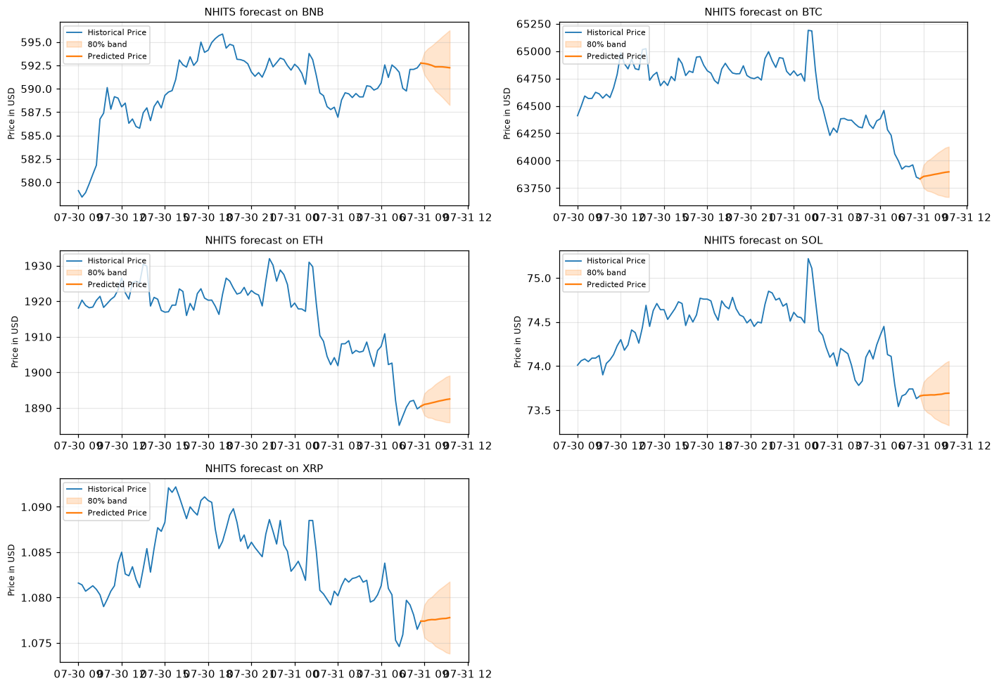

#### GRU

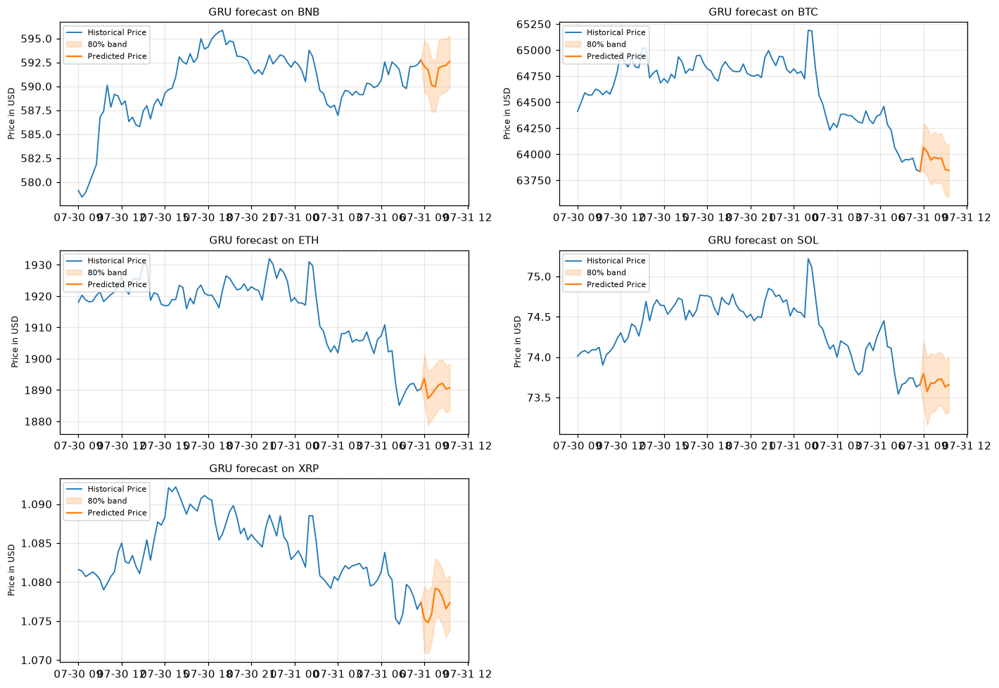

#### LSTM

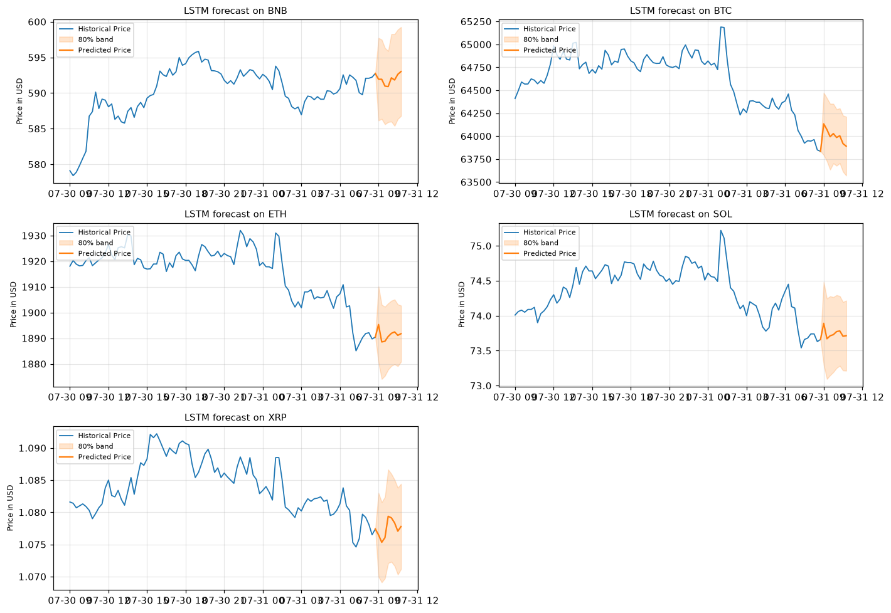

#### TFT

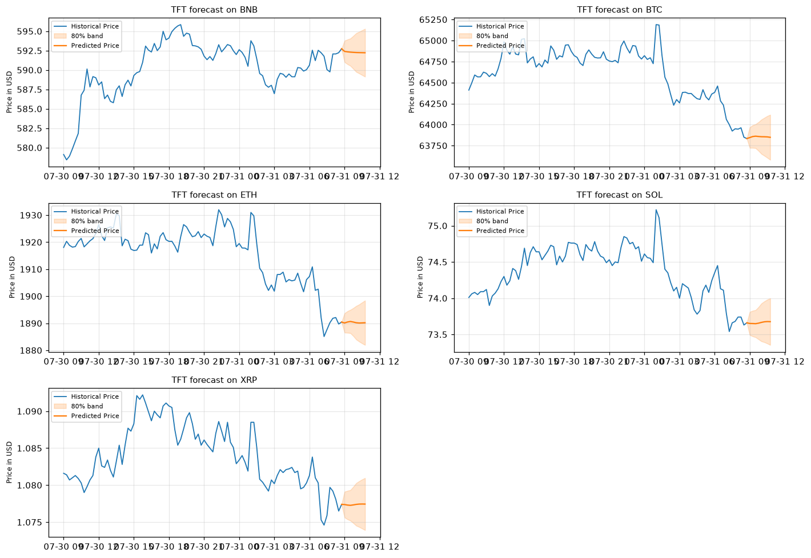

#### Ensemble

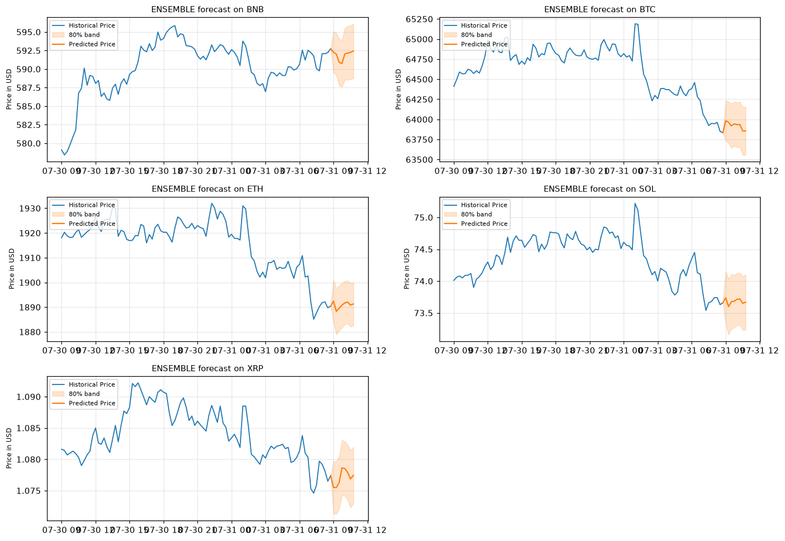

</details>

The ensemble artifact was scored separately on the same calibrated 16-origin test
slice recorded in `results_legacy.csv`; it is displayed for completeness but is
not inserted into the architecture-only table above.

The current N-HiTS rerun was interrupted before evaluation and therefore produced
no replacement metrics. It must complete successfully before its outputs can be
reported.

## 10. Next-day TFT experiment: pending

The next planned experiment reframes TFT as a next-day price-path model:

- Input frequency: 15 minutes.
- Lookback: 672 bars, equivalent to seven days.
- Forecast horizon: 96 bars, equivalent to the next 24 hours.
- Evaluation schedule: 365 daily origins.
- Calibration split: first 219 origins.
- Untouched chronological test: final 146 origins.
- Known-future covariates: sine/cosine encodings for time of day and day of week.

Training is intentionally user-operated because of GPU cost. No next-day TFT
performance values are available yet. A run is reportable only when its status is
complete and its manifest validates the saved model, predictions, metric tables
and plots.

```powershell
python -m neural.nf_run --model tft --run-id <safe-run-id> --output-root artifacts/evaluation --accelerator gpu --batch-size 16
```

This experiment forecasts a path; it does not yet convert forecasts into buy,
sell or hold decisions and contains no transaction-cost or portfolio backtest.

## 11. Reproducibility and evidence

Local run directories preserve prediction tables, run metadata and generated
reports. The committed repository contains the final metadata plus derived metric
tables and plots. The corrected final tree and neural prediction Parquets are
local, ignored artifacts, so a clean clone can inspect the committed report hashes
but cannot fully revalidate the manifest's input-file hashes without regenerating
those prediction tables. Evaluation manifests record the data cutoff, fold count,
model names, horizons and provenance-relative paths.

The detailed daily methodology is documented in
[`docs/evaluation-methodology.md`](docs/evaluation-methodology.md). The curated
cross-pipeline scoreboard and its caveats are in [`RESULTS.md`](RESULTS.md).

Install dependencies and fetch data:

```powershell
python -m venv .venv
.\.venv\Scripts\python.exe -m pip install -r requirements.txt

.\.venv\Scripts\python.exe fetch.py
.\.venv\Scripts\python.exe fetch.py --tf 15m
```

Run the completed daily model families:

```powershell
.\.venv\Scripts\python.exe -m tree.run --output-root artifacts/evaluation
.\.venv\Scripts\python.exe -m neural.run --output-root artifacts/evaluation
```

Train and save individual daily models:

```powershell
.\.venv\Scripts\python.exe -m tree.lgbm
.\.venv\Scripts\python.exe -m tree.xgb
.\.venv\Scripts\python.exe -m neural.dlinear
.\.venv\Scripts\python.exe -m neural.lstm
```

Generate a forecast from a saved daily model:

```powershell
.\.venv\Scripts\python.exe predict.py --model lstm
.\.venv\Scripts\python.exe predict.py --model xgb --asset BTC --horizon 4
```

Run the legacy high-frequency models individually:

```powershell
.\.venv\Scripts\python.exe -m neural.nf_run --model nhits
.\.venv\Scripts\python.exe -m neural.nf_run --model gru
.\.venv\Scripts\python.exe -m neural.nf_run --model lstm
```

## 12. Repository structure

```text
crypto/        data collection, feature construction, calibration, backtesting and plots
tree/          LightGBM and XGBoost volatility models
linear/        Ridge, HAR-RV and GARCH diagnostic models
neural/        Daily DLinear/LSTM and high-frequency NeuralForecast experiments
experiments/   naive baselines, classical price models, model zoo and feature ablation
tests/         causality, evaluation, artifact and TFT pipeline tests
data/          local Parquet datasets and legacy CV outputs; mostly gitignored
models/        saved deployable daily model artifacts
artifacts/      non-overwriting model-run predictions and metadata
docs/          methodology, verified metric tables and report plots
RESULTS.md     curated scoreboard with pipeline-specific caveats
```

Feature construction is shared in `crypto/features.py`; model-family directories
contain only their own adapters and estimators. This keeps feature definitions and
evaluation rules consistent across model comparisons.

## 13. Limitations

- Historical metrics end at the 2026-07-23 cutoff and are not current forecasts.
- The evaluated daily folds informed feature and ensemble selection; future data
  is required for untouched post-selection validation.
- Five assets and one exchange do not represent the full cryptocurrency market.
- Coverage is close to 80% overall but varies across assets, horizons, folds and
  regimes.
- Multiple horizons from the same origin are correlated and should not be treated
  as independent observations.
- Pinball loss in price units is influenced by high-priced assets; normalized
  `pinball_%` is included for cross-asset interpretation.
- Forecast quality is not trading profitability. Fees, slippage, latency,
  position sizing and portfolio risk have not been modeled.

## 14. Future work and production layer

The next data science milestone is to complete the fixed next-day TFT run and
evaluate it against persistence and momentum-volatility baselines on the untouched
146-origin test period. A later signal-research phase can define buy/sell/hold
rules and evaluate them with transaction costs, slippage and risk controls.

For production use, the project still needs:

1. **Automated ingestion:** scheduled OHLCV and derivatives collection with data
   freshness, schema, duplicate, gap and incomplete-candle checks.
2. **Scheduled retraining:** a documented weekly or monthly policy triggered only
   after enough new chronological data has accumulated.
3. **Model registry:** versioned model, feature-schema, dataset-cutoff, metric and
   calibration artifacts with promotion and rollback rules.
4. **Inference service:** a reproducible batch or API layer that loads one approved
   model version and returns forecasts with uncertainty intervals.
5. **Monitoring:** production checks for missing data, feature drift, forecast
   error, interval coverage, latency and model degradation.

These components are future goals and are not represented as completed features
of the current repository.
