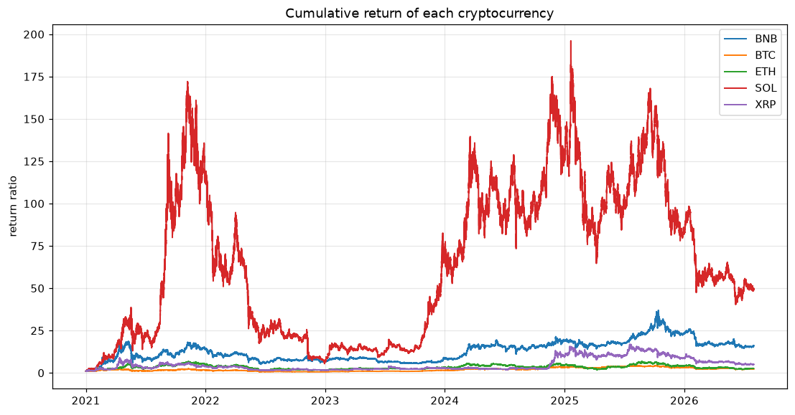

# Results

All numbers are out-of-sample, walk-forward. Daily features are verified causal
by the executable `crypto.features.check_causal` corruption check. The 15-minute
pipeline constructs features only from the current and preceding bars, but its
earlier corruption-check output is not retained in this repository.
Daily and 15-min are **separate pipelines** — their numbers are not comparable
to each other and are reported apart.

---

## The question and the finding

> Can we predict cryptocurrency price?

| tested | result |
|---|---|
| Price **direction** (up/down) | **No robust signal** — results varied by model and short test window |
| Price **level** | **No** — nothing beats a flat "price stays put" baseline |
| **Volatility** | **Modestly lower aggregate loss on this historical selection/evaluation sample** than a rolling-average baseline; horizon-level results are mixed |

Scaling the LSTM to 4× training steps, 2× capacity, and 2× lookback did not improve
its recorded accuracy. This is evidence of diminishing returns for that experiment,
not proof that no model can improve on the data.

---

## Daily volatility — 7-day interval forecast (1,445 origins, 5 assets)

Historical OOS measurement: data cutoff **2026-07-23**, forecast origins
2021-01-01 through 2026-07-14. These folds were also consulted for feature and
ensemble decisions, so they are an exploratory selection/evaluation sample, not
untouched post-selection validation or a current/live forecast. A locked comparison
requires future chronological data strictly after the cutoff; rerunning these folds
does not create an untouched test. Exact provenance, subgroup tables, and charts are
in the [daily methodology](docs/evaluation-methodology.md) and
[generated evidence](docs/evaluation/daily-20260723/).

Predict daily volatility, turn it into a calibrated price interval. Lower pinball
better; coverage target is 80%.

| model | family | pinball | coverage % |
|---|---|---|---|
| LSTM | neural | **162.98** | 79.9 |
| DLinear | neural | 163.28 | 79.8 |
| XGBoost | tree | 166.74 | 78.8 |
| LightGBM | tree | 167.69 | 78.8 |
| vol_21d (baseline) | — | 167.99 | 79.3 |

On this sample, LSTM's aggregate pinball loss is about 2.3% lower than XGBoost's.
This modest observed difference has no uncertainty interval here, does not identify
a cause, and is not validated evidence of post-selection generalization.

---

## 15-min high-frequency — 2-hour forecast (~1M rows, 16 test origins)

The table records the initial comparison (1,000 steps, 96-bar lookback); current
code defaults to 4,000 steps and a 192-bar lookback and therefore requires a fresh
run before its outputs can replace this table. MAPE is the median
forecast error; DirAcc is up/down accuracy on the 2-hour move; R² is on **returns**
(price-R² would be a meaningless ~0.99).

| model | MAPE % | R²(returns) | DirAcc % | raw coverage % |
|---|---|---|---|---|
| N-HiTS | **0.27** | +0.03 | 66.2 | 75.8 |
| GRU | 0.34 | -0.28 | 58.8 | 80.8 |
| LSTM | 0.35 | -0.31 | 63.8 | 81.3 |
| TFT | 0.30 | -0.10 | **48.8** | 65.0 |

**The DirAcc numbers do not establish a robust signal.** They come from a short,
trending test window and range from 48.8% to 66.2% across architectures. A scaled
LSTM run dropped to 52.5%, showing that the apparent result was configuration- and
window-sensitive rather than stable evidence of directional edge.

---

## Method

- **Walk-forward** validation, expanding window — never a single split.
- **Baselines first** — candidate measurements are reported beside flat / drift / seasonal baselines.
- **Causal daily features** — an executable corruption test guards against the
  look-ahead leak that invalidated the original version of this project.
- **Conformal calibration** — neural native quantiles are overconfident; empirical
  per-horizon widening restores ~80% coverage.

---

## Plots

Return correlation across coins (why panel training works — they move together):

Cumulative returns:

LSTM 2-hour forecast with 80% interval:

---

## Honest caveats

- 15-min coverage/DirAcc come from only 16 test origins — thin. The direction
  finding is robust (confirmed by TFT and the scaled LSTM); the exact coverage % is not.
- 0.27% MAPE at a 2-hour horizon is low mostly because price barely moves over 2
  hours — it is honest, but close to a naive-lag baseline. It is not evidence of edge.
- This is a research finding, not a trading system. No live P&L is claimed.
